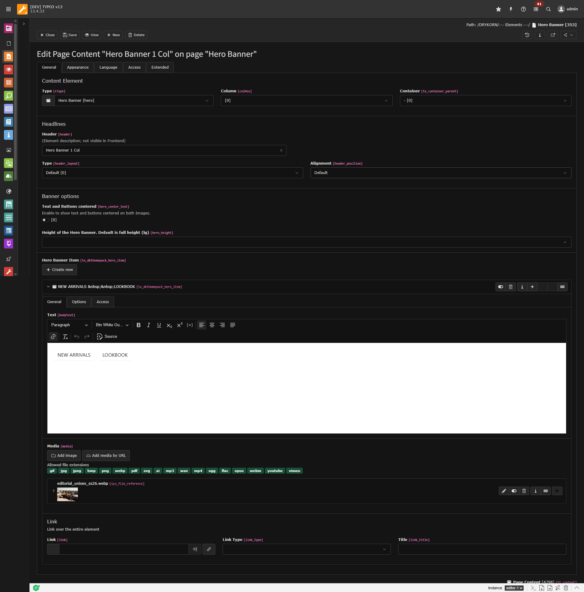

# DRYKORN Themepack — Inhaltselemente

Handbuch fuer Redakteure. Dieses Dokument beschreibt alle verfuegbaren Inhaltselemente im TYPO3-Backend.
Fuer jedes Element werden Zweck, Felder und Hinweise zur Nutzung erlaeutert.

---

## Inhaltsverzeichnis

1. [Hero Banner](#hero-banner)
2. [Card Group](#card-group)
3. [Category Group](#category-group)
4. [Look Group](#look-group)
5. [Lookbook](#lookbook)
6. [Wall Grid](#wall-grid)
7. [Icon Group](#icon-group)
8. [Gallery](#gallery)
9. [Accordion](#accordion)
10. [Tab](#tab)
11. [Timeline](#timeline)
12. [USPs](#usps)
13. [Progress Bar](#progress-bar)
14. [Kategorie-Navigation](#kategorie-navigation)
15. [Footer Navigation](#footer-navigation)
16. [Media](#media)
17. [Container / Layouts](#container--layouts)
18. [News: WE_MIND Blog](#news-we_mind-blog)
19. [News: Jobs / Karriere](#news-jobs--karriere)

---

## Banner

### Hero Banner

Grossflaechiges Bannerelement fuer den Seiteneinstieg. Zeigt ein Bild oder Video ueber die volle Seitenbreite mit optionalem Text-Overlay und Button. Mehrere Slides sind moeglich.

#### Optionen des Elements

| Feld | Beschreibung |
|------|-------------|
| Ueberschrift | Wird oberhalb des Banners angezeigt (optional). |
| Text & Buttons zentriert | Zentriert den Text-Overlay ueber dem gesamten Banner. |
| Hoehe | Klein / Mittel / Gross. Bestimmt die sichtbare Hoehe des Banners. |
| Rahmen oben/unten | Fuegt oben und/oder unten einen sichtbaren Rahmen hinzu. |

Felder pro Slide-Eintrag

<table>
<tr><th>Feld</th><th>Beschreibung</th></tr>
<tr><td>Ueberschrift</td><td>Headline auf dem Slide.</td></tr>
<tr><td>Text</td><td>Beschreibungstext (Richtext-Editor).</td></tr>
<tr><td>Bild / Video</td><td>Hintergrundbild oder -video fuer den Slide.</td></tr>
<tr><td>Link</td><td>Button-Link.</td></tr>
<tr><td>Linktyp</td><td>Detail / Navigation / Landingpage / Extern / Modal.</td></tr>
<tr><td>Link-Titel</td><td>Beschriftung des Buttons.</td></tr>
<tr><td>Textfarbe</td><td>Standard oder Schwarz.</td></tr>
<tr><td>Hintergrundfarbe</td><td>Keine / Weiss / Hellgrau / Dunkel / Verlauf — als farbiger Overlay.</td></tr>
</table>

> **Tipp:** Die Anzahl der Slides bestimmt das Layout: 1 Slide = 1-spaltig, 2 Slides = 2-spaltig, 3 Slides = 3-spaltig. Mit aktiviertem "Text & Buttons zentriert" wird der Text mittig ueber allen Spalten dargestellt. Bei Linktyp »Modal« wird ein Video-Overlay geoeffnet statt eines Seitenwechsels.

---

## Karten, Gruppen & Galerien

### Card Group

Zeigt Inhalte als Kartengitter an — ideal fuer Teaser, Stories oder Lookbooks. Auf Mobilgeraeten werden die Karten als Slider dargestellt.

#### Optionen des Elements (FlexForm)

| Feld | Beschreibung |
|------|-------------|
| Stil | Kein / Teaser / Story / Fixe Hoehe. Bestimmt die Darstellungsart. |
| Karten-Stil | Kein / Weisser Hintergrund / Heller Hintergrund / Dunkler Hintergrund / Rahmen. |
| Ausrichtung | Links / Zentriert / Rechts. |
| Animation | Aktiviert eine Einblendanimation (Fade-Up) mit zeitversetztem Erscheinen. |
| Spalten | 1 / 2 / 3 / 4 Spalten im Desktop-Layout. |
| Rahmen oben/unten | Fuegt oben und/oder unten einen sichtbaren Rahmen hinzu. |

Felder pro Karte

<table>
<tr><th>Feld</th><th>Beschreibung</th></tr>
<tr><td>Text</td><td>Kartentext (Richtext).</td></tr>
<tr><td>Bild</td><td>Visuelles Element der Karte (max. 1 Bild).</td></tr>
<tr><td>Link-Titel</td><td>Beschriftung des Buttons.</td></tr>
<tr><td>Link</td><td>Verlinkung der Karte.</td></tr>
<tr><td>Linktyp</td><td>Detail / Navigation / Landingpage / Extern / Modal.</td></tr>
</table>

---

### Category Group

Shopware-Kategorie-Slider mit Herren/Damen-Umschalter. Zeigt Produktkategorien als Slider mit verschiedenen Darstellungsarten: Freisteller, Editorial-Bilder oder Texteinblendungen.

#### Optionen des Elements

| Feld | Beschreibung |
|------|-------------|
| Ueberschrift | Titel ueber dem Slider. |
| Peek-Effekt | Zeigt beim Laden kurz an, dass weitere Inhalte vorhanden sind. |
| Rahmen oben/unten | Fuegt oben und/oder unten einen sichtbaren Rahmen hinzu. |

Felder pro Kategorie-Eintrag

<table>
<tr><th>Feld</th><th>Beschreibung</th></tr>
<tr><td>Typ</td><td>Freisteller / Editorial-Text aussen / Editorial-Text innen / NOS.</td></tr>
<tr><td>Bild-Anpassung</td><td>Contain (vollstaendig anzeigen) oder Cover (zuschneiden).</td></tr>
<tr><td>Hauptkategorie</td><td>Herren / Damen — bestimmt, bei welchem Tab die Karte erscheint.</td></tr>
<tr><td>Kategorie-Label</td><td>Beschriftung der Kategorie.</td></tr>
<tr><td>Unterkategorien</td><td>Inline-Eintraege mit Bild, Link, Titel, Subline und Textfarbe.</td></tr>
</table>

> **Tipp:** Ueber die Hauptkategorie (Herren/Damen) wird automatisch ein animierter Tab-Umschalter erzeugt. Bei Typ »Freisteller« wirkt ein freigestelltes Produktbild am besten.

---

### Look Group

Outfit-Slider, der komplette Looks mit verlinkten Produkten zeigt. Jeder Slide enthaelt ein grosses Look-Bild mit kleinen Produkt-Icons, die auf die jeweiligen Produktseiten verlinken.

Felder pro Look-Eintrag

<table>
<tr><th>Feld</th><th>Beschreibung</th></tr>
<tr><td>Titel</td><td>Name des Looks.</td></tr>
<tr><td>Look-Bild</td><td>Das Hauptbild des Outfits (max. 1 Bild).</td></tr>
<tr><td>Produkt-Bilder</td><td>Bis zu 3 kleine Produktbilder. Jedes kann ueber die Bild-Metadaten auf eine Produktseite verlinkt werden.</td></tr>
</table>

---

### Lookbook

Bildergalerie im Fashion-Lookbook-Stil. Unter jedem Bild koennen bis zu 3 Produkt-Links hinterlegt werden, die auf den Shopware-Shop verweisen.

#### Felder

| Feld | Beschreibung |
|------|-------------|
| Ueberschrift | Titel des Lookbooks. |
| Textfarbe | Schwarz oder Standard. |
| Bilder | Die Lookbook-Bilder. Pro Bild koennen bis zu 3 Produkt-Links und 3 Kategorien hinterlegt werden (in den Bild-Metadaten). Zusaetzlich: Mobil ausblenden, Bild-Anpassung, Position, Ausrichtung. |

> **Tipp:** Die Produkt-Links und Kategorien werden direkt an der jeweiligen Bildreferenz eingetragen — die Felder erscheinen, sobald ein Bild hinzugefuegt wurde.

---

### Wall Grid

Bildwand-Layout mit Rasterdarstellung. Alle 8 Bilder wird automatisch ein Textblock (Subueberschrift und Bodytext) eingeblendet. Jedes Bild kann individuell mit einem Shopware-Produktlink versehen werden.

#### Felder

| Feld | Beschreibung |
|------|-------------|
| Ueberschrift / Subueberschrift | Titel und Zwischentitel fuer den eingeblendeten Textblock. |
| Text | Richtext-Inhalt fuer den Textblock. |
| Bilder | Pro Bild kann ein individueller Link hinterlegt werden (in den Bild-Metadaten). |
| Rahmen | Rahmenlinien oben/unten. |

---

### Icon Group

Raster aus Icons mit begleitendem Text — fuer Features, Services oder Vorteile. Icons koennen aus den hinterlegten Icon-Sets oder als eigenes Bild hochgeladen werden.

#### Optionen des Elements (FlexForm)

| Feld | Beschreibung |
|------|-------------|
| Ausrichtung | Links / Zentriert / Rechts. |
| Spalten | Auto / 1–7 Spalten. |
| Icon-Position | Links-Oben / Links-Mitte / Rechts-Oben / Rechts-Mitte / Darueber / Darunter. |

Felder pro Icon-Eintrag

<table>
<tr><th>Feld</th><th>Beschreibung</th></tr>
<tr><td>Text</td><td>Beschreibung neben dem Icon (Richtext).</td></tr>
<tr><td>Link</td><td>Optionale Verlinkung.</td></tr>
<tr><td>Icon-Set</td><td>Auswahl aus den verfuegbaren Icon-Bibliotheken.</td></tr>
<tr><td>Icon</td><td>Auswahl eines konkreten Icons aus dem gewaehlten Set.</td></tr>
<tr><td>Icon-Datei</td><td>Alternativ: eigenes Bild als Icon hochladen (erscheint wenn kein Set gewaehlt).</td></tr>
</table>

---

### Gallery

Bildergalerie mit einstellbarem Seitenverhaeltnis. Ideal fuer Kampagnenbilder oder Produktfotos in einheitlichem Format.

#### Felder

| Feld | Beschreibung |
|------|-------------|
| Bilder | Die Galeriebilder. |
| Seitenverhaeltnis | Einheitliches Format fuer alle Bilder. |
| Elemente pro Seite | Anzahl der sichtbaren Bilder pro Seite. |
| Rahmen | Rahmenlinien oben/unten. |

---

## Listen & interaktive Elemente

### Accordion

Aufklappbare Bereiche — z.B. fuer FAQ, Produktdetails oder Zusatzinformationen. Jeder Bereich kann Richtext oder eine Tabelle sowie Medien enthalten.

#### Optionen des Elements

| Feld | Beschreibung |
|------|-------------|
| Ueberschrift | Titel ueber dem Accordion. |

Felder pro Accordion-Eintrag

<table>
<tr><th>Feld</th><th>Beschreibung</th></tr>
<tr><td>Ueberschrift</td><td>Titel des aufklappbaren Bereichs (Pflichtfeld).</td></tr>
<tr><td>Tabellen-Modus</td><td>Schaltet zwischen Richtext und Tabellendarstellung um.</td></tr>
<tr><td>Text</td><td>Inhalt des Bereichs (Richtext, sichtbar wenn Tabellen-Modus aus).</td></tr>
<tr><td>Textbreite</td><td>25% / 33% / 50% / 75% der Gesamtbreite.</td></tr>
<tr><td>Tabelle</td><td>Tabelleninhalt mit Klasse, Trennzeichen und Ueberschrift (sichtbar wenn Tabellen-Modus an).</td></tr>
<tr><td>Medien</td><td>Bilder oder Videos neben dem Text.</td></tr>
</table>

> **Tipp:** Im Tabellen-Modus koennen Groessentabellen oder Datenvergleiche komfortabel dargestellt werden.

---

### Tab

Tab-Navigation mit mehreren Reitern. Jeder Reiter zeigt beim Klick seinen Inhalt an (Medien wie Bilder oder Videos).

#### Optionen des Elements

| Feld | Beschreibung |
|------|-------------|
| Ueberschrift | Titel ueber den Tabs. |
| Standard-Tab | Welcher Tab beim Laden aktiv ist (FlexForm). |

Felder pro Tab-Eintrag

<table>
<tr><th>Feld</th><th>Beschreibung</th></tr>
<tr><td>Ueberschrift</td><td>Tab-Beschriftung in der Navigation.</td></tr>
<tr><td>Medien</td><td>Bilder oder Videos, die im Tab-Bereich angezeigt werden.</td></tr>
</table>

---

### Timeline

Vertikale Zeitleiste mit Datumsmarkierungen — z.B. fuer Unternehmensgeschichte, Meilensteine oder Projektverlaeufe.

#### Optionen des Elements

| Feld | Beschreibung |
|------|-------------|
| Ueberschrift | Titel ueber der Timeline. |
| Sortierung | Aufsteigend / Absteigend nach Datum (FlexForm). |

Felder pro Timeline-Eintrag

<table>
<tr><th>Feld</th><th>Beschreibung</th></tr>
<tr><td>Datum</td><td>Das Datum des Eintrags — die Jahreszahl wird als Markierung angezeigt.</td></tr>
<tr><td>Ueberschrift</td><td>Titel des Zeitpunkts.</td></tr>
<tr><td>Text</td><td>Beschreibung (Richtext).</td></tr>
<tr><td>Icon-Set / Icon</td><td>Icon aus einer Bibliothek.</td></tr>
<tr><td>Icon-Datei</td><td>Alternativ: eigenes Bild als Icon.</td></tr>
<tr><td>Bild</td><td>Optionales Bild zum Eintrag.</td></tr>
</table>

---

### USPs

Horizontale Leiste mit Alleinstellungsmerkmalen (Unique Selling Points). Wird als scrollbares Karussell mit Icons und Text dargestellt — z.B. fuer Versandvorteile, Serviceversprechen oder Zertifizierungen.

Felder pro USP-Eintrag

<table>
<tr><th>Feld</th><th>Beschreibung</th></tr>
<tr><td>Text</td><td>Kurzbeschreibung des USP (Richtext).</td></tr>
<tr><td>Icon-Set / Icon</td><td>Icon aus einer Bibliothek.</td></tr>
<tr><td>Icon-Datei</td><td>Alternativ: eigenes Bild als Icon (erscheint wenn kein Set gewaehlt).</td></tr>
</table>

---

### Progress Bar

Animierte Fortschrittsbalken — z.B. fuer Nachhaltigkeitsziele, Skill-Levels oder Projektfortschritte. Die Balken werden beim Scrollen animiert.

Felder pro Balken

<table>
<tr><th>Feld</th><th>Beschreibung</th></tr>
<tr><td>Bezeichnung</td><td>Label des Balkens (Pflichtfeld).</td></tr>
<tr><td>Wert</td><td>Prozentwert von 0–100 (Pflichtfeld).</td></tr>
</table>

---

## Spezialelemente

### Kategorie-Navigation

Horizontale Navigationsleiste mit Links zu Shopware-Kategorien. Zeigt einen Intro-Text und darunter eine Reihe von Kategorie-Links.

#### Felder

| Feld | Beschreibung |
|------|-------------|
| Ueberschrift | Titel ueber der Navigation. |
| Kategorie-Intro | Einleitungstext ueber der Navigation. |

Felder pro Navigationseintrag

<table>
<tr><th>Feld</th><th>Beschreibung</th></tr>
<tr><td>Titel</td><td>Anzeigetext des Links.</td></tr>
<tr><td>Link</td><td>Shopware-Pfad (Slug der Kategorie).</td></tr>
<tr><td>Linktyp</td><td>Detail / Navigation / Landingpage / Extern.</td></tr>
</table>

---

### Footer Navigation

Aufklappbare Spalte im Footer-Bereich. Zeigt eine Ueberschrift als Klappmenue-Trigger und den Inhalt als erweiterbaren Bereich (auf Mobilgeraeten).

#### Felder

| Feld | Beschreibung |
|------|-------------|
| Ueberschrift | Titel der Footer-Spalte — dient gleichzeitig als Klapp-Trigger. |
| Text | Inhalt der Spalte (Richtext) — z.B. Links, Kontaktdaten, Texte. |

---

### Media

Universelles Medien-Element fuer Bilder, Videos (YouTube, Vimeo, MP4) und PDFs. Unterstuetzt Galerie-Layouts und kann auf Mobilgeraeten ausgeblendet werden.

#### Felder

| Feld | Beschreibung |
|------|-------------|
| Medien | Bilder, Videos oder PDFs aus der Dateiliste. |
| Mobil verbergen | Blendet das Element auf kleinen Bildschirmen aus. |

---

## Container / Layouts

Container sind keine eigenstaendigen Inhaltselemente, sondern Huellen, die andere Elemente in Spalten-Layouts anordnen.

### Verfuegbare Container

| Container | Beschreibung |
|-----------|-------------|
| 2 Spalten (gleich) | Zwei gleichbreite Spalten nebeneinander. |
| 2 Spalten (links breit) | Linke Spalte breiter als rechte (ca. 60/40). |
| 2 Spalten (rechts breit) | Rechte Spalte breiter als linke (ca. 40/60). |
| 3 Spalten | Drei gleichbreite Spalten. |
| 4 Spalten | Vier gleichbreite Spalten. |
| Slider | Umschliesst Elemente in einem horizontalen Slider. |
| Tabs | Umschliesst Elemente in einer Tab-Navigation. |

> **Tipp:** Container koennen verschachtelt werden. Beispiel: Innerhalb einer 2-Spalten-Anordnung kann eine Spalte wiederum einen Slider enthalten.

### Gemeinsame Optionen (Erscheinungsbild)

Jedes Inhaltselement — ob eigenstaendig oder in einem Container — besitzt im Tab **Erscheinungsbild** folgende Optionen:

| Option | Beschreibung |
|--------|-------------|
| Layout | Frame-Groesse: Default / Full (100%) / Large (1240px) / Medium (960px) / Small (625px). |
| Frame-Klasse | Optischer Rahmen des Elements (z.B. Well, Jumbotron, None). |
| Abstand oben/unten | Default / Small / None — steuert den vertikalen Abstand. |
| Frame-Optionen | Einrueckung links/rechts (sichtbar wenn Frame-Klasse nicht "None"). |

---

## News: WE_MIND Blog

Die Blog-Beitraege werden ueber die **News-Extension** (georgringer/news) verwaltet. Im Backend werden sie als News-Datensaetze im Ordner **WE_MIND** (SysFolder PID 189) gepflegt.

### Einrichtung auf einer Seite

1. Inhaltselement **News system > News-Listenansicht** einfuegen.
2. Im Plugin die Startseite/Storage auf den WE_MIND-Ordner setzen.
3. Fuer die Detailansicht: auf derselben Seite ein zweites News-Plugin als **Detailansicht** einfuegen, oder das gleiche Plugin im Modus *Liste und Detail* nutzen.

### Felder eines Blog-Beitrags

| Feld | Beschreibung |
|------|-------------|
| Typ | **Blog-Beitrag** (Typ 0, templateLayout 10). |
| Titel | Ueberschrift des Beitrags. |
| Teaser | Kurztext fuer die Listenansicht. |
| Datum | Veroeffentlichungsdatum — bestimmt die Sortierung. |
| Bild | Vorschaubild fuer Liste und Detailansicht (Hero). |
| Inhalt (Content Elements) | Der eigentliche Beitragsinhalt wird ueber eingebettete Inhaltselemente (Texte, Bilder, etc.) aufgebaut. |
| Kategorien | Fuer Filterung in der Listenansicht. |
| Tags | Fuer Filterung in der Listenansicht. |
| Verwandte Dateien | PDFs oder andere Dateien zum Download im Beitrag. |

> **Tipp:** Die Listenansicht zeigt automatisch einen Kategorie-Filter. Blog-Beitraege haben das templateLayout **WE_MIND (10)**, was das spezielle Blog-Design aktiviert.

---

## News: Jobs / Karriere

Stellenanzeigen werden ebenfalls ueber die **News-Extension** verwaltet, jedoch als eigener Typ **Karriere** (Typ 1, templateLayout 99). Sie liegen im SysFolder **Karriere** (PID 204).

### Einrichtung auf einer Seite

1. Inhaltselement **News system > News-Listenansicht** einfuegen.
2. Im Plugin die Startseite/Storage auf den Karriere-Ordner setzen.
3. Die Detailansicht wird auf derselben Seite angezeigt. Der Seitentitel wird automatisch aus dem News-Titel uebernommen.

### Felder einer Stellenanzeige

| Feld | Beschreibung |
|------|-------------|
| Typ | **Karriere** (Typ 1, templateLayout 99). |
| Titel | Stellenbezeichnung (wird als Headline der Detailseite angezeigt). |
| Dachzeile | Erscheint oberhalb des Titels (z.B. Bereich oder Standort). |
| Teaser | Kurztext fuer die Listenansicht. |
| Datum | Veroeffentlichungsdatum. |
| Bild | Headerbild fuer die Detailseite (vollflaechig). |
| Content Elements | Hauptinhalt der Stellenanzeige — typischerweise mit 2-Spalten-Layout (Beschreibung links, Sidebar rechts). |
| Meta-Daten | Level und Standort — werden in einer eigenen Meta-Leiste unterhalb des Headers angezeigt. |
| Kategorien | Fuer Filterung (z.B. Abteilung, Standort). |

### Aufbau der Detailseite

Die Karriere-Detailseite hat ein eigenes Layout:

1. **Header** — Vollflaechiges Headerbild mit Dachzeile und Stellentitel.
2. **Meta-Leiste** — Zeigt Level und Standort in voller Breite.
3. **Inhaltsbereich** — Typischerweise 2-Spalten-Layout mit Stellenbeschreibung (links) und Sidebar (rechts, z.B. Ansprechpartner, Quick-Facts).

> **Tipp:** Die Detailansicht bricht automatisch aus dem Frame der Listenansicht aus, sodass Header und Meta-Leiste vollflaechig dargestellt werden, waehrend der Inhaltsbereich im normalen Seitenlayout bleibt.

---

*DRYKORN Themepack — dk_themepack fuer TYPO3 v13*
